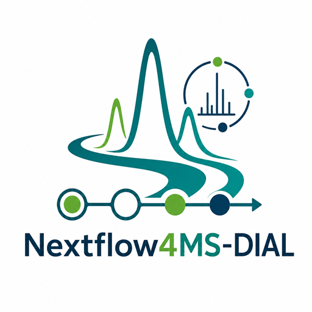

# Nextflow4MS-DIAL



**A reproducible Nextflow workflow for LC-HRMS metabolomics data processing with MS-DIAL.**

[](https://www.nextflow.io/)
[](https://app.codacy.com/gh/Nextflow4Metabolomics/nextflow4ms-dial/dashboard?utm_source=gh&utm_medium=referral&utm_content=&utm_campaign=Badge_grade)

## Introduction

**Nextflow4MS-DIAL** is a bioinformatics workflow for Liquid
Chromatography-High Resolution Mass Spectrometry (LC-HRMS) metabolomics data
processing. It uses [Nextflow](https://www.nextflow.io/) to run MS-DIAL-based
analyses reproducibly across local computers, containers, and high-performance
computing environments.

The workflow includes Docker and Singularity support to simplify installation,
improve portability, and make results easier to reproduce. It supports macOS and
Linux and has been tested successfully on:

- macOS 13.5.1 with a 2.6 GHz 6-Core Intel Core i7 processor and 16 GB memory.
- HiPerGator, the University of Florida public research computing environment, running Red Hat Enterprise Linux 8.8.

## Installation

1. Install Java 11 or later. The workflow was developed with Java 11.0.8.
2. Install [Nextflow](https://nf-co.re/usage/installation).
3. Install [Docker](https://docs.docker.com/engine/installation/) for local
   execution or [Singularity](https://www.sylabs.io/guides/3.0/user-guide/) for
   many high-performance computing systems.

## Quick Start

Clone the repository:

```bash
git clone https://github.com/Nextflow4Metabolomics/nextflow4ms-dial.git
cd nextflow4ms-dial
```

Run the functional test profile:

```bash
nextflow run main.nf -profile functional_test > logs/execution.log
```

## Example Data and Results

The example dataset is publicly available on
[Google Drive](https://drive.google.com/drive/folders/1atsy-TlfJSs0sw2ZCvbkqOSAbZFYRqdy).
It comes from the following publication:

> Li, Z., Lu, Y., Guo, Y., Cao, H., Wang, Q., & Shui, W. (2018).
> Comprehensive evaluation of untargeted metabolomics data processing software
> in feature detection, quantification, and discriminating marker selection.
> *Analytica Chimica Acta*, 1029, 50-57.

The dataset contains 10 samples, with five samples in each of two groups. The
processing protocol is also available through MetaboLights
[MTBLS733](https://www.ebi.ac.uk/metabolights/editor/MTBLS733/protocols).

Run the example dataset with Docker:

```bash
nextflow run main.nf -profile docker > logs/execution.log
```

Example outputs are stored in the `results` folder. The file extensions for
produced `.msdial` files have been changed to `.tsv` so the files can be opened
in spreadsheet software such as Microsoft Excel. Example execution logs are
stored in the `logs` folder.

## Process Your Own Data

1. Clone the repository:

   ```bash
   git clone https://github.com/Nextflow4Metabolomics/nextflow4ms-dial.git
   cd nextflow4ms-dial
   ```

2. Remove the example data and place your raw data files in `data/raw_data/`.
   The workflow accepts `.mzML` and `.abf` files.

3. Convert other raw data formats to `.mzML` with
   [ProteoWizard msConvert](https://proteowizard.sourceforge.io/download.html),
   or create `.abf` files with
   [Reifycs Abf Converter](https://www.reifycs.com/AbfConverter/).

4. Add the MS-DIAL and MS-FLO configuration files to the `data/` folder and
   name them `msdial_params.txt` and `msflo_params.ini`. Example configuration
   files are available in `functional_test/sample_data/`.

5. Add the MS1 and MS2 libraries to the `data/` folder and name them
   `ms1_lib.txt` and `ms2_lib.msp`. Example library files are available in
   `functional_test/sample_data/`.

6. Run the pipeline. Use the `docker` profile for local execution and the
   `singularity` profile for high-performance computing environments:

   ```bash
   nextflow run main.nf -profile docker > logs/execution.log
   ```

## Configuration

- Before processing your own data, confirm that the reference file in
  `conf/base.config` and the MS-DIAL configuration file are set correctly.
- Docker configuration is defined in `conf/base.config`.
- High-performance computing and Singularity configuration is defined in `conf/HiPerGator.config`.
- MS-DIAL and MS-FLO parameters are defined in their respective configuration files.

## Log File Interpretation

- `execution_report.html` summarizes workflow runtime and computational resource usage.
- `execution_timeline.html` shows the execution timeline for each process.
- `logs/execution.log` is an example log from a successful execution. It
  includes metadata such as the Nextflow and workflow versions, parameter
  settings, resource allocation, container information, workflow progress, and
  process-level logs.
- `error.txt` is an example error log from a failed execution.

## FAQ

### Why was a process not executed after pipeline execution?

To avoid unexpected errors, do not use special characters in file names. Underscores are safe to use.

### Why did Slurm report `Process requirement exceed available CPUs -- req: 5; avail: 3` after I allocated 20 CPUs?

Use `--max_cpus`, not `--cpus`, in the configuration file to define the CPUs available to each process.

## Semantic Annotations

- Input: mzML [EDAM:format_3244]
- Output: CSV [EDAM:format_3752]
- Operations: peak detection [EDAM:operation_3215], chromatogram alignment
  [EDAM:operation_3628], metabolite identification [EDAM:operation_3803]

## Citation

Please cite the following publication if you use Nextflow4MS-DIAL in scientific work:

Du X, Dobrowolski A, Brochhausen M, Garrett TJ, Hogan WR, Lemas DJ.
Nextflow4MS-DIAL: A Reproducible Nextflow-Based Workflow for Liquid
Chromatography-Mass Spectrometry Metabolomics Data Processing. *Journal of the
American Society for Mass Spectrometry*. Published online January 5, 2025.
doi:10.1021/jasms.4c00364

## Credits

Nextflow4MS-DIAL was developed primarily by Xinsong Du. Dr. Dominick Lemas,
Dr. Xinsong Du's Ph.D. advisor, and Xinsong Du contributed to the project
concept.
